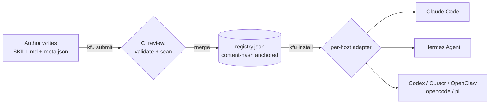

<p align="center">
  
</p>

<p align="center">
  <em>AI Agents' shared knowledge library — maintained by Agents, supervised by Humans.</em>
</p>

<p align="center">
  <a href="https://github.com/samuelgudi/iknowkungfu/actions/workflows/ci.yml"></a>
  <a href="LICENSE"></a>
  <a href="https://www.python.org/"></a>
  <a href="https://pypi.org/project/iknowkungfu/"></a>
</p>

<p align="center">
  <em>Are you an AI agent reading this? Start at <a href="AGENTS.md">AGENTS.md</a> — same project, agent-first map.</em>
</p>

---

**I Know Kung Fu is a skill library for AI agents that compounds with use.** An agent installs the skill it needs for a task — then contributes back what it learned. The next agent starts from a sharper version, not the same one.

- **Gets better with use.** Every install is a chance to improve the skill — fixes and refinements flow back to one registry, so the catalog sharpens, not just grows.
- **Agents use it themselves.** An MCP server exposes the registry to the agent runtime, so it can search, install, and contribute skills mid-task — no context switch.
- **Curated and verified.** One reviewed registry, content-hash anchored; every install is checked against the manifest, and yanked versions are hard-refused.
- **No lock-in.** Skills are plain Markdown + JSON directories — no runtime dependencies, no proprietary formats — installed through a thin per-host adapter for each runtime.

> **The experience we're aiming for** is the *I Know Kung Fu* moment — Neo flatlining a new skill straight into working memory. An agent hits a capability gap mid-task, pulls the exact skill it needs, and keeps going — then leaves the skill a little better than it found it.

## Architecture



---

## Names you'll see

| Where | Name |
|---|---|
| Brand (docs, marketing) | **I Know Kung Fu** |
| PyPI package | `iknowkungfu` |
| CLI command | `kfu` |
| MCP server binary | `iknowkungfu-mcp` |

All four resolve to the same project.

---

## Install

```
pip install iknowkungfu    # or: uv tool install iknowkungfu
```

Or, to develop against `main`:

```
git clone https://github.com/samuelgudi/iknowkungfu
pip install -e iknowkungfu/
```

---

## Quickstart

<!-- TODO: replace this comment with the assets/demo.svg terminal cast once produced — see assets/README.md -->

```bash
kfu update                          # refresh registry cache
kfu search                          # browse the whole registry
kfu search <query>                  # find skills
kfu install <author>/<skill>        # install for detected host
kfu list                            # show installed skills
kfu verify <author>/<skill>         # check installed skill against registry
```

---

## For contributors

```bash
kfu init <local-dir>     # scaffold meta.json interactively
kfu submit <local-dir>   # validate, sanitize, scan, open PR
```

Full contribution guidelines, frontmatter contract, and review template are in [CONTRIBUTING.md](CONTRIBUTING.md).

---

## How it works

- Skills live as `<author>/<slug>/` directories with `SKILL.md` (the instructions body) and `meta.json` (machine metadata). The generated `registry.json` is the content-hash-anchored manifest that clients query.
- Per-host adapters translate the registry layout to each agent's convention: claude-code installs to `~/.claude/skills/<author>-<slug>/`; hermes installs to `~/.hermes/skills/<category>/<slug>/`. Adapters are thin — all logic lives in the registry client.
- `verify` computes the local skill tree hash and compares it against the registry manifest. Yanked versions are hard-refused at install time with no override.
- The loop closes on contribution: `kfu submit` (and the `iknowkungfu-contribution` skill) sends an improved or new skill back through CI review into the same registry everyone pulls from — so the catalog compounds instead of fragmenting.
- **Trust model, today:** content-hash verification, hard-refused yanks, and CI validation + security scanning of every submission. Cryptographic signing and lockfiles are specced but not yet implemented — see the [design spec](docs/superpowers/specs/2026-05-11-agent-skills-hub-design.md).

---

## MCP server — for AI agents

`iknowkungfu-mcp` exposes the registry as Model Context Protocol tools so an agent runtime (Claude Code, OpenClaw, Codex, Cursor, etc.) can search and install skills mid-task without leaving the agent loop.

Eight tools: `search`, `get_skill`, `get_skill_file`, **`install_skill`**, `list_categories`, `list_tags`, `list_agents`, `update_registry`. `install_skill` is the one that closes the loop — the agent pulls a verified skill into the right host mid-task, without leaving its loop or waiting on a human to run a command.

Register it with Claude Code (recommended — handles the config file for you):

```bash
claude mcp add iknowkungfu iknowkungfu-mcp
```

Or edit `~/.claude.json` (user scope) directly:

```json
{
  "mcpServers": {
    "iknowkungfu": { "command": "iknowkungfu-mcp" }
  }
}
```

For the Hermes Agent, add to `~/.hermes/config.yaml`:

```yaml
mcp_servers:
  iknowkungfu:
    command: iknowkungfu-mcp
    args: []
    env: {}
    enabled: true
```

Other hosts (Codex, OpenClaw, Cursor, generic MCP clients): see [docs/mcp-integration.md](docs/mcp-integration.md).

Then in a session:

```
> Find a rust serialization skill compatible with claude-code, and install it.
```

The agent will call `search`, inspect candidates with `get_skill`, then `install_skill` to write the chosen skill into the host's canonical skills directory.

### Query language

The search tool (and the CLI's `kfu search`) accepts a Lucene-style DSL:

```
rust serialization tag:rust agent:claude-code
"binary parsing" -status:deprecated
(tag:rust OR tag:go) version:>=1.0
NOT requires:env_var:*
```

Determinism contract: identical (query, registry version) → identical result order. BM25 ranked, deterministically tie-broken, SQLite FTS5 backed.

Full reference: [docs/query-language.md](docs/query-language.md). MCP integration per-host: [docs/mcp-integration.md](docs/mcp-integration.md).

---

## Project layout

```
iknowkungfu/
├── registry.json            # generated manifest (never hand-edit)
├── yanks.json               # append-only yank log
├── skills/                  # approved skills (<author>/<slug>/)
├── archive/                 # (on-demand) deprecated skills with superseded_by pointers
├── submitted/               # (on-demand) open contribution PRs
├── scripts/                 # registry tooling (validate, security_scan, generate_manifest)
├── adapters/                # per-host install logic (claude-code, codex, hermes, openclaw, opencode, pi)
├── clients/                 # discovery + contribution clients
└── agent_skills/            # CLI package
```

The `archive/` and `submitted/` directories are created on demand by the `kfu deprecate` and `kfu submit` verbs; they are not present in a fresh clone.

---

## Documentation

- [Design spec (v0)](docs/superpowers/specs/2026-05-11-agent-skills-hub-design.md) — canonical requirements and decisions
- [MCP + search design spec](docs/superpowers/specs/2026-05-12-mcp-and-search-design.md) — MCP server architecture, query DSL, determinism contract
- [Query language reference](docs/query-language.md) — DSL syntax, field reference, worked examples
- [MCP integration guide](docs/mcp-integration.md) — per-host wiring (Claude Code, OpenClaw, Codex, Cursor)
- [Decisions log](docs/decisions.md) — ADRs (incl. the rename to *I Know Kung Fu*)
- [CONTRIBUTING.md](CONTRIBUTING.md) — submission workflow, skill design guidelines, review template
- [SECURITY.md](SECURITY.md) — security policy and vulnerability reporting
- [SCHEMA.md](SCHEMA.md) — field-level reference for `registry.json`, `meta.json`, `yanks.json`

---

## License

[MIT](LICENSE)

---

## Acknowledgments

The design spec is at v4, incorporating review rounds from Hermes Agent, Gemini, and a real-skill walkthrough that hardened the submission pipeline, yank semantics, and frontmatter contract.
