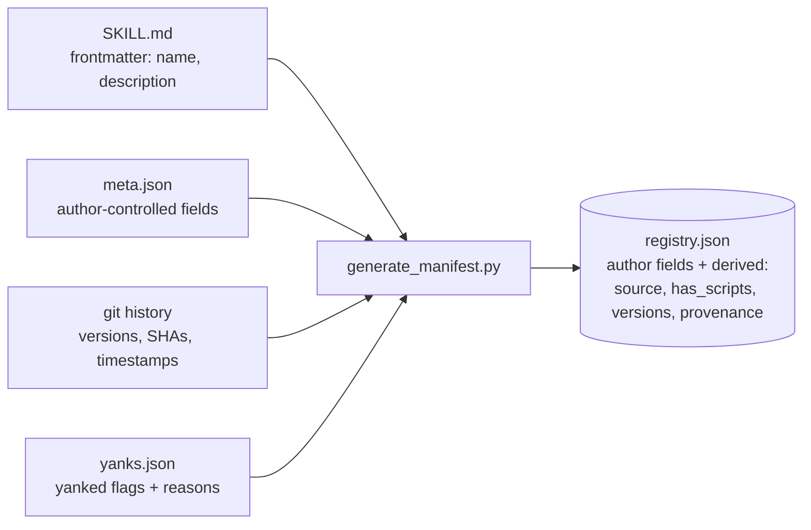

# iknowkungfu Schema Reference

> **Authority**: This file is the canonical reference for `validate.py` (Task 8) and `generate_manifest.py` (Task 10). If there is drift between this document and the spec at `docs/superpowers/specs/2026-05-11-agent-skills-hub-design.md`, **the spec wins** and this file must be updated to match. When adding new categories or fields, open a PR that updates both this file and the spec simultaneously.

---

## 1. Overview

`SCHEMA.md` defines every field in `registry.json`, `meta.json`, and `yanks.json`; the valid category taxonomy; the slug grammar; and the semver requirement for version strings. `validate.py` uses these definitions to enforce correctness on individual skill submissions before they reach CI. `generate_manifest.py` uses them to rebuild `registry.json` from the authoritative on-disk skill trees and `yanks.json`. Both tools must treat this document as their field-level source of truth — any rule not stated here is undefined behaviour.

`registry.json` is **generated, never hand-edited**. It is assembled from four inputs — only two of which authors control directly:



Authors edit `SKILL.md` and `meta.json`. Everything else — `source`, `has_scripts`, `versions`, `provenance`, and the `name` / `description` mirrored from frontmatter — is **derived** by `generate_manifest.py` and must not be hand-set in `meta.json` (see § 4).

---

## 2. `registry.json` Top-Level Structure

```json
{
  "schema_version": 2,
  "generated_at": "2026-05-11T14:00:00Z",
  "skills": [ /* array of skill entries — see § 3 */ ]
}
```

| Field | Type | Notes |
|---|---|---|
| `schema_version` | integer | Always `2`. Breaking schema changes increment this. |
| `generated_at` | string (ISO 8601) | Commit timestamp of the generating commit — not wall clock. Reproducible. |
| `skills` | array | Ordered array of skill entry objects (see § 3). |

> **v3 change**: `schema_version` bumped from 1 to 2. Breaking changes introduced: `author.github_id` became required; `versions` map became required; the `yanked` flag moved from skill level to per-version inside `versions`.

---

## 3. Skill Entry Fields

Below is the full field-semantics table from spec § 7, updated to v4.

| Field | Type | Required | Notes |
|---|---|---|---|
| `id` | string | yes | `<author>/<slug>`. Immutable. Primary key. |
| `name` | string | yes | Bare slug. Mirrors SKILL.md frontmatter `name`. |
| `description` | string | yes | **The trigger string** — what `match.py` scores against. Authors should include synonyms. |
| `version` | string | yes | Semver. The current/latest version. See § 8 for format rules. |
| `status` | enum | yes | `"active"` \| `"deprecated"`. Obsolescence semantics (see note below). |
| `author` | object | yes | `{name, github_login, github_id}`. The **curator / maintainer-of-record** — the account accountable for this entry. For an imported skill this is the importer, **not** the original author (see `origin` and § 9). `github_id` is GitHub's immutable numeric user ID. |
| `category` | string | yes | One value from the v0 starter taxonomy (see § 6): `media` \| `dev` \| `ops` \| `data` \| `comms` \| `docs` \| `meta` \| `ai`. Drives Hermes install path. New categories admitted via PR to this file with rationale. |
| `tags` | string[] | optional | Free-form, lowercase. **Capped at 10 entries** by `validate.py` to mitigate keyword stuffing. |
| `platforms` | string[] | optional | Default `["linux", "macos", "windows"]`. Hermes adapter translates to frontmatter `platforms:` at install time. |
| `agent_compat` | string[] | yes | Subset of `{claude-code, hermes, codex, opencode, pi, openclaw}`. |
| `requires` | object | optional | Declared deps: `env_vars` (strings) and `commands` (binary names the host must have on PATH). Hermes adapter translates to frontmatter `prerequisites:`. No `toolsets` field — removed in v4 (Decision #18). |
| `has_scripts` | bool | derived | `true` if `scripts/` directory exists in the skill tree. Triggers stricter review (Decision #5). Set by `generate_manifest.py`; do not set manually in `meta.json`. |
| `license` | string | yes | SPDX identifier (e.g. `"MIT"`, `"Apache-2.0"`). |
| `install` | object | yes | Per-agent install metadata — sparse, host-specific options only. Keys are agent names from `agent_compat`. |
| `source` | object | derived | `{path, content_hash, files}`. Reflects the current version. Set by `generate_manifest.py`. |
| `versions` | object | yes | Map `{ <semver>: { sha, released, yanked?, yank_reason? } }`. Built by `generate_manifest.py` from git history; `yanks.json` merges in the `yanked` flag. Enables O(1) version pinning. |
| `provenance` | object | derived | `{submitted_pr, merged_at, reviewed_by}`. Set on merge by CI. |
| `origin` | object | optional | Present **only on imported skills**. Author-supplied, display-only attribution of the original source — see the *origin object* below and § 9. Distinct from the derived `provenance` field; the two must not be confused. |
| `composes` | string[] | optional | Reserved for hierarchical skill composition. Empty array if unused. |
| `extends` | string\|null | optional | Reserved. `null` if unused. |
| `supersedes` | string[] | optional | IDs of skills this skill replaces. Empty array if unused. |
| `superseded_by` | string\|null | **required if `status == "deprecated"`** | ID of the replacement active skill. `null` otherwise. |

### `author` object

The `author` object identifies the **curator / maintainer-of-record** — the account that submitted, is accountable for, and is the reviewer-of-record for this registry entry. For a first-party skill the curator *is* the original author. For an imported skill the curator is the importer; the original author is credited separately in the `origin` block (§ 9). The `author` object never changes meaning — it is always the identity/accountability anchor, never a claim of original authorship.

```json
{
  "name": "Samuel Gudi",
  "github_login": "samuelgudi",
  "github_id": 12345678
}
```

| Sub-field | Type | Required | Notes |
|---|---|---|---|
| `name` | string | yes | Display name. |
| `github_login` | string | yes | GitHub username at registration time (Decision #4). |
| `github_id` | integer | yes | GitHub's immutable numeric user ID. Fetched by `kfu init` via `gh api users/<login>`. Binds skill identity to the account, not just the login string. |

### `versions` map

```json
{
  "0.1.0": { "sha": "abc111…", "released": "2026-05-09T12:00:00Z" },
  "0.1.1": { "sha": "abc222…", "released": "2026-05-10T08:00:00Z", "yanked": true, "yank_reason": "Reason." },
  "0.2.0": { "sha": "abc333…", "released": "2026-05-11T15:00:00Z" }
}
```

| Sub-field | Type | Required | Notes |
|---|---|---|---|
| `sha` | string | yes | Git tree SHA for this version. Allows content reconstruction from history. |
| `released` | string (ISO 8601) | yes | Commit timestamp when this version was merged. |
| `yanked` | bool | no | `true` means this version is hard-refused at install time (no `--allow-yanked` override exists). Distinct from `status: "deprecated"` (Decision #10). |
| `yank_reason` | string | required if `yanked: true` | Human-readable reason. Must explain why and what users should upgrade to. |

### `source` object

```json
{
  "path": "skills/samuelgudi/spotify-search",
  "content_hash": "sha256:abc123…",
  "files": ["SKILL.md", "scripts/search.py", "templates/result-format.md", "meta.json"]
}
```

| Sub-field | Type | Notes |
|---|---|---|
| `path` | string | Relative path to skill directory from repo root. |
| `content_hash` | string | Hash of the current latest version's tree. Prior-version hashes are recoverable from `versions[ver].sha`. |
| `files` | string[] | All files enumerated under the skill directory. |

### `requires` object

```json
{
  "env_vars": ["SPOTIFY_CLIENT_ID", "SPOTIFY_CLIENT_SECRET"],
  "commands": ["ffmpeg"]
}
```

| Sub-field | Type | Notes |
|---|---|---|
| `env_vars` | string[] | Environment variable names the skill needs at invoke time. |
| `commands` | string[] | Binary names that must be on PATH before invoking the skill. No package-manager installs at runtime — dependencies are pre-declared here (Decision #14). |

> **Note**: there is no `toolsets` sub-field. It was removed in v4 (Decision #18) because it was undefined. It may be re-added as an additive change when a concrete use case and semantics are agreed.

### `origin` object

The `origin` object is present **only on imported skills** — skills re-hosted from a third-party source rather than authored first-party (ADR-002). It is **author-supplied** in `meta.json` and carries display-only credit for the original author and source. It is **not** identity-binding and is **not** verified against the GitHub API — it is a citation, not an account. It must not be confused with the derived `provenance` field (`{submitted_pr, merged_at, reviewed_by}`), which is set by CI and describes the registry PR, not the upstream source.

```json
{
  "author_name": "Jesse Vincent",
  "author_url": "https://github.com/obra",
  "repo": "https://github.com/obra/superpowers-skills",
  "ref": "a1b2c3d4e5f6",
  "imported_at": "2026-05-14T00:00:00Z"
}
```

| Sub-field | Type | Required | Notes |
|---|---|---|---|
| `author_name` | string | yes | Display name of the original author. Non-empty. Display-only — not identity-binding, not API-verified. |
| `author_url` | string | optional | Link to the original author (e.g. their GitHub profile). Non-empty when present. |
| `repo` | string | yes | URL of the source repository the skill was imported from. |
| `ref` | string | yes | The exact git commit SHA (or ref) the skill was imported from. Pins the source for auditability and re-sync. |
| `imported_at` | string (ISO 8601) | yes | Timestamp of the import. |

There is no `license` sub-field inside `origin`: the skill's top-level `license` field already carries the source license (an importer cannot re-license someone else's work, so the two are necessarily identical). For licenses that require it (e.g. Apache-2.0), the source `LICENSE`/`NOTICE` file is bundled into the skill directory — `validate.py` permits `LICENSE`, `LICENSE.txt`, and `NOTICE` in the root of a skill that has an `origin` block, and rejects them otherwise.

### `status` semantics

| Value | Meaning | Install behaviour |
|---|---|---|
| `"active"` | Skill is maintained and recommended. | Normal install. |
| `"deprecated"` | Skill is obsolete; `superseded_by` must be non-null. | Install requires `--allow-deprecated` flag. Soft-hide in discovery results. |

Deprecation is distinct from yanking. A deprecated skill is still installable (with a flag); a yanked version is hard-refused.

### `install` object

The `install` object is keyed by agent name (`claude-code`, `hermes`, etc.). Each value is a sparse object of host-specific install options.

```json
{
  "claude-code": { "scope": "user" },
  "hermes": {}
}
```

Hermes-specific frontmatter (`platforms:`, `prerequisites:`, etc.) is synthesized by the Hermes adapter at install time from other registry fields — it does not live in `install`.

### Canonical skill entry example

```json
{
  "id": "samuelgudi/spotify-search",
  "name": "spotify-search",
  "description": "Search Spotify by track, artist, or album using the Web API. Use when the user asks to find, look up, or check songs/albums/artists on Spotify.",
  "version": "0.2.0",
  "status": "active",
  "author": {
    "name": "Samuel Gudi",
    "github_login": "samuelgudi",
    "github_id": 12345678
  },
  "category": "media",
  "tags": ["spotify", "music", "search", "api"],
  "platforms": ["linux", "macos", "windows"],
  "agent_compat": ["claude-code", "hermes"],
  "requires": {
    "env_vars": ["SPOTIFY_CLIENT_ID", "SPOTIFY_CLIENT_SECRET"],
    "commands": []
  },
  "has_scripts": true,
  "license": "MIT",
  "install": {
    "claude-code": { "scope": "user" },
    "hermes": {}
  },
  "source": {
    "path": "skills/samuelgudi/spotify-search",
    "content_hash": "sha256:abc123…",
    "files": ["SKILL.md", "scripts/search.py", "templates/result-format.md", "meta.json"]
  },
  "versions": {
    "0.1.0": { "sha": "abc111000…", "released": "2026-05-09T12:00:00Z" },
    "0.1.1": { "sha": "abc222000…", "released": "2026-05-10T08:00:00Z", "yanked": true, "yank_reason": "Compromised upstream dependency in scripts/search.py; users must upgrade to 0.2.0+." },
    "0.2.0": { "sha": "abc333000…", "released": "2026-05-11T15:00:00Z" }
  },
  "provenance": {
    "submitted_pr": 42,
    "merged_at": "2026-05-09T12:00:00Z",
    "reviewed_by": "samuelgudi"
  },
  "composes": [],
  "extends": null,
  "supersedes": [],
  "superseded_by": null
}
```

---

## 4. `meta.json` Fields

`meta.json` lives in the skill directory (`skills/<author>/<slug>/meta.json`). It is the **author-maintained** machine metadata file — the source from which `generate_manifest.py` builds the registry entry.

`meta.json` contains the subset of registry entry fields that are author-controlled. Derived fields (`has_scripts`, `source`, `provenance`, `versions`) are **not** present in `meta.json` — they are computed by `generate_manifest.py`.

```json
{
  "id": "samuelgudi/spotify-search",
  "version": "0.2.0",
  "status": "active",
  "author": {
    "name": "Samuel Gudi",
    "github_login": "samuelgudi",
    "github_id": 12345678
  },
  "category": "media",
  "tags": ["spotify", "music", "search", "api"],
  "platforms": ["linux", "macos", "windows"],
  "agent_compat": ["claude-code", "hermes"],
  "requires": {
    "env_vars": ["SPOTIFY_CLIENT_ID", "SPOTIFY_CLIENT_SECRET"],
    "commands": []
  },
  "license": "MIT",
  "install": {
    "claude-code": { "scope": "user" },
    "hermes": {}
  },
  "composes": [],
  "extends": null,
  "supersedes": [],
  "superseded_by": null,
  "related_skills": []
}
```

| Field | Type | Required in meta.json | Notes |
|---|---|---|---|
| `id` | string | yes | `<github_login>/<slug>`. Must match directory path. |
| `version` | string | yes | Semver. Current version of this skill. |
| `status` | enum | yes | `"active"` \| `"deprecated"`. |
| `author` | object | yes | `{name, github_login, github_id}`. The curator / maintainer-of-record (see § 3 *author object* and § 9). `github_id` fetched by `kfu init` at first submission. |
| `category` | string | yes | Must be one of the eight valid categories (see § 6). |
| `tags` | string[] | optional | Free-form, lowercase, max 10. |
| `platforms` | string[] | optional | Default `["linux", "macos", "windows"]`. |
| `agent_compat` | string[] | yes | Subset of `{claude-code, hermes, codex, opencode, pi, openclaw}`. |
| `requires` | object | optional | `{env_vars, commands}`. No `toolsets`. |
| `license` | string | yes | SPDX identifier. |
| `install` | object | yes | Per-agent install metadata. |
| `origin` | object | optional | Present only on imported skills (§ 9). Author-supplied. See § 3 *origin object* for the field shape. |
| `composes` | string[] | optional | Reserved. Empty array if unused. |
| `extends` | string\|null | optional | Reserved. `null` if unused. |
| `supersedes` | string[] | optional | Reserved. Empty array if unused. |
| `superseded_by` | string\|null | required if `status == "deprecated"` | Replacement skill ID. |
| `related_skills` | string[] | optional | Informational list of related skill IDs. Not used by tooling in v0. |

### Fields NOT in `meta.json`

The following fields appear in `registry.json` but must not be set in `meta.json`. They are derived by `generate_manifest.py`:

| Derived field | Source |
|---|---|
| `name` | Taken from `SKILL.md` frontmatter `name:`. |
| `description` | Taken from `SKILL.md` frontmatter `description:`. Must match `meta.json` implied description or CI fails. |
| `has_scripts` | Computed: `true` if `scripts/` directory exists. |
| `source` | Computed from directory walk and git tree hash. |
| `versions` | Built from git history + merged from `yanks.json`. |
| `provenance` | Set from PR metadata on merge. |

---

## 5. `yanks.json` Structure

`yanks.json` lives at the registry root. It is an append-only log of yanked versions. `generate_manifest.py` reads it on every regeneration and applies `yanked: true` + `yank_reason` to the matching `versions[ver]` entries inside `registry.json`.

```json
{
  "yanks": [
    {
      "id": "samuelgudi/spotify-search",
      "version": "0.1.1",
      "yanked_at": "2026-05-12T09:00:00Z",
      "yanked_by": "samuelgudi",
      "reason": "Compromised upstream dependency in scripts/search.py; users must upgrade to 0.2.0+."
    }
  ]
}
```

| Field | Type | Required | Notes |
|---|---|---|---|
| `id` | string | yes | Skill ID in `<author>/<slug>` form. |
| `version` | string | yes | Semver of the specific version being yanked. |
| `yanked_at` | string (ISO 8601) | yes | Timestamp of the yank decision. |
| `yanked_by` | string | yes | GitHub login of the person authorising the yank (maintainer or author). |
| `reason` | string | yes | Human-readable explanation. Must explain the risk and the recommended upgrade path. |

**Yank rules:**

- Yanks are **append-only**. Once a version is yanked, it stays yanked.
- Removing an entry from `yanks.json` is allowed only via a separate explicit PR with a documented reason (e.g. false-positive recall).
- Yanked versions are **hard-refused at install time**. There is no `--allow-yanked` override in v0.
- Yanking is distinct from `status: "deprecated"`. A deprecated skill can still be installed with `--allow-deprecated`; a yanked version cannot be installed at all.

---

## 6. Category Taxonomy

The v0 starter set contains exactly **eight** categories (Decision #15). Every skill entry must use one of these values exactly. New categories are admitted via PR to this file with rationale — new values not listed here will fail `validate.py`.

| Category | Description |
|---|---|
| `media` | Skills for audio, video, images, streaming platforms, and media metadata. |
| `dev` | Skills for software development: code search, linting, build tools, VCS operations. |
| `ops` | Skills for infrastructure, DevOps, server management, monitoring, and deployment. |
| `data` | Skills for data processing, transformation, databases, spreadsheets, and analytics. |
| `comms` | Skills for communication: email, chat, messaging platforms, and notifications. |
| `docs` | Skills for document creation, editing, summarisation, and knowledge management. |
| `meta` | Skills about the iknowkungfu system itself (registry introspection, tooling helpers). |
| `ai` | Skills for interacting with AI services, models, APIs, and AI-adjacent workflows. |

---

## 7. Slug Grammar

A slug is the `<slug>` portion of a skill `id` (`<author>/<slug>`). The canonical slug regex is:

```
^[a-z][a-z0-9-]{0,38}[a-z0-9]$
```

Rules derived from this pattern:

- Starts with a lowercase ASCII letter.
- Ends with a lowercase ASCII letter or digit.
- Middle characters: lowercase ASCII letters, digits, or hyphens only.
- Total length: 2 to 40 characters.
- No consecutive hyphens, no leading/trailing hyphens (enforced by the start/end anchors).

The full skill `id` is `<github_login>/<slug>`. Both components are immutable after first registration (Decision #4). The `github_login` follows GitHub's own username rules; `validate.py` only validates the slug portion against the regex above.

---

## 8. Semver Requirement

All `version` fields (in both `registry.json` skill entries and `meta.json`) must be valid **Semantic Versioning 2.0.0** strings as defined at [semver.org](https://semver.org/).

Accepted forms:

```
MAJOR.MINOR.PATCH
MAJOR.MINOR.PATCH-prerelease
MAJOR.MINOR.PATCH-prerelease+build
```

Examples: `0.1.0`, `1.0.0`, `2.3.1-beta.1`, `1.0.0-alpha+001`.

`validate.py` rejects any version string that does not parse as valid semver. The `versions` map keys in `registry.json` must also be valid semver strings — they are the canonical version identifiers used for pinning.

**v0 note**: skills in early development should use `0.x.y` versions (no stability guarantees). The `1.0.0` milestone is a signal that the public interface is stable.

---

## 9. Imported Skills

An **imported skill** is one re-hosted from a third-party open-source source rather than authored first-party. The model is defined in **ADR-002** (`docs/decisions.md`). Summary of the schema-level rules:

- An imported skill carries an **`origin` block** in `meta.json` (and, passed through, in `registry.json`). The presence of `origin` is what marks a skill as imported — there is no separate flag.
- The **`author` object continues to mean curator / maintainer-of-record**, exactly as for first-party skills. It is the importer's identity and accountability anchor — never a claim of original authorship. The immutable-GitHub-ID binding (Decision #4) is unchanged.
- The original author is credited in **`origin.author_name`** / **`origin.author_url`** — display-only, not identity-binding, not API-verified. Consumer-facing surfaces (`kfu show`) render imported skills as *"curated by `<curator>`, originally by `<origin author>`"* — never as *"by `<curator>`"*.
- The top-level **`license`** field carries the source license faithfully. There is no `origin.license` — an importer cannot re-license the work, so it would only duplicate the top-level field.
- For licenses that require notice preservation (e.g. Apache-2.0), the source `LICENSE`/`NOTICE` is **bundled into the skill directory**. `validate.py` permits `LICENSE`, `LICENSE.txt`, and `NOTICE` in the root of a skill that has an `origin` block, and rejects them as extraneous otherwise.

Accepting ADR-002 authorises this *tooling*; it does not authorise importing any specific skill. Each import remains a per-skill, human-reviewed decision.

---

## Appendix: Field Quick Reference

| Field | Present in `registry.json` | Present in `meta.json` | Derived |
|---|---|---|---|
| `id` | yes | yes | no |
| `name` | yes | no | yes (from SKILL.md) |
| `description` | yes | no | yes (from SKILL.md) |
| `version` | yes | yes | no |
| `status` | yes | yes | no |
| `author` | yes | yes | no |
| `category` | yes | yes | no |
| `tags` | yes | yes | no |
| `platforms` | yes | yes | no |
| `agent_compat` | yes | yes | no |
| `requires` | yes | yes | no |
| `has_scripts` | yes | no | yes |
| `license` | yes | yes | no |
| `install` | yes | yes | no |
| `source` | yes | no | yes |
| `versions` | yes | no | yes |
| `provenance` | yes | no | yes |
| `origin` | yes | yes | no |
| `composes` | yes | yes | no |
| `extends` | yes | yes | no |
| `supersedes` | yes | yes | no |
| `superseded_by` | yes | yes | no |
| `related_skills` | no | yes | no |
